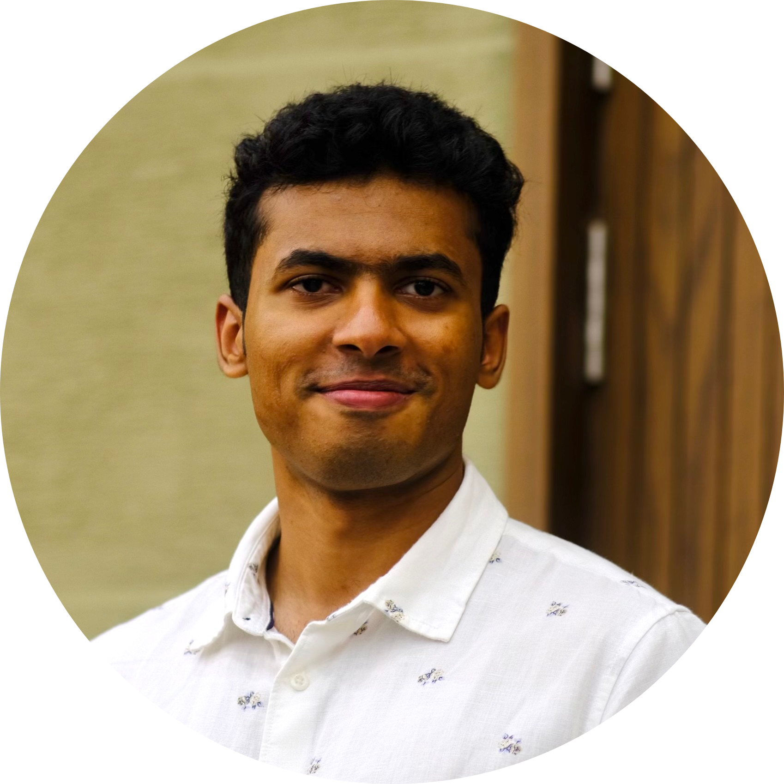

  
  <h1>Sahel Iqbal</h1>

I'm Sahel Iqbal, a third-year PhD student at Aalto University, Finland, where I
work with [Simo Särkkä](https://users.aalto.fi/~ssarkka/). My main
research focus is on developing accurate and efficient Monte Carlo algorithms
for reinforcement learning and Bayesian experimental design (BED). Recently, I
have also developed an interest in how similar algorithms can be used for
inference-time alignment of diffusion and [large language models](posts/steering-llms-with-smc.html).

For details regarding my research, see my [Google
Scholar](https://scholar.google.com/citations?user=KP7mJUgAAAAJ&hl=en) profile.
I can be contacted on [X](https://x.com/sahel_iqbal) and at my email
sahel[dot]iqbal[at]aalto[dot]fi.

Outside work, my time is mostly taken up by reading, lifting weights, and
writing JAX code. The projects that I'm actively working on are available on
[GitHub](https://github.com/Sahel13).

## Recent News

- **2026-01**: We released a new JAX library for inference in state-space models
  called `cuthbert`! Checkout the [tweet](https://x.com/sahel_iqbal/status/2017210852642803839?s=20) and the [code](https://github.com/state-space-models/cuthbert).
- **2025-09**: Our paper [Sequential Monte Carlo for Policy Optimization in
  Continuous POMDPs](https://arxiv.org/abs/2505.16732) has been accepted to
  NeurIPS 2025!
- **2025-07**: If you're attending [MCM
  2025](https://ccbatiit.github.io/mcm2025/), my coauthor [Adrien
  Corenflos](https://adriencorenflos.github.io/) will be giving a talk on our
  joint work on BED.
- **2025-06**: Gave a talk on using particle filters for amortized BED at the
  _[Accelerating statistical inference and experimental design with machine
  learning workshop](https://www.newton.ac.uk/event/rclw03/)_ at the Isaac Newton
  Institute for Mathematical Sciences.
- **2024-12**: Presented a poster at the [Bayesian Decision-making and
  Uncertainty workshop](https://gp-seminar-series.github.io/neurips-2024/) at
  NeurIPS 2024 in Vancouver.

## Posts

$for(recentPosts)$

  
$date$

  

    <a href="$url$">$title$</a> ---
    $description$
  

$endfor$

## Featured Publications

_* denotes equal contribution._

Hany Abdulsamad\*, **Sahel Iqbal**\*, Simo Särkkä (2025). _Sequential Monte
Carlo for policy optimization in continuous POMDPs_. NeurIPS.
[arXiv](https://arxiv.org/abs/2505.16732).
[Code](https://github.com/Sahel13/particle-pomdp/).

Mahdi Nasiri, **Sahel Iqbal**, Simo Särkkä (2025). _Physics-informed machine
learning for grade prediction in froth flotation_. Minerals Engineering.
[Link](https://doi.org/10.1016/j.mineng.2025.109297).

**Sahel Iqbal**, Hany Abdulsamad, Sara Pérez-Vieites, Simo Särkkä, Adrien
Corenflos (2024). _Recursive nested filtering for efficient amortized Bayesian
experimental design_. NeurIPS workshop on Bayesian Decision-making and
Uncertainty. [arXiv](https://arxiv.org/abs/2409.05354).
[Code](https://github.com/Sahel13/InsideOutNPF.jl).

**Sahel Iqbal**, Hany Abdulsamad, Tripp Cator, Ulisses Braga-Neto, Simo Särkkä
(2024). _Parallel-in-time probabilistic solutions for time-dependent nonlinear
partial differential equations_. IEEE MLSP.
[Link](https://ieeexplore.ieee.org/document/10734739).
[Code](https://github.com/hanyas/parallel-pde).

**Sahel Iqbal**, Adrien Corenflos, Simo Särkkä, Hany Abdulsamad (2024). _Nesting
particle filters for experimental design in dynamical systems_. ICML.
[arXiv](https://arxiv.org/abs/2402.07868).
[Code](https://github.com/Sahel13/InsideOutSMC.jl).
